# Introduction :

The "lab.cpp" module is designed to manage a database of video cards, enabling users to perform operations such as adding new records, viewing existing records, and searching based on specific criteria. 

**Critical Functions**: The key functions include adding new records, viewing existing records, and searching for video cards based on specific criteria.

**Key Variables**: The primary variables include the `VideoCard` structure to store information about each video card, as well as variables for user input and file handling.

**Interdependencies**: The module interacts with the file system to store and retrieve video card records, establishing a crucial dependency on file operations for data management.

**Core vs. Auxiliary Operations**: The core operations involve adding, viewing, and searching for video card records, while auxiliary operations may include data validation and error handling.

**Operational Sequence**: The program operates via a menu system where users can choose to add new records, view existing records, or search for specific video cards. Each operation involves interactions with the file system for data manipulation.

**Performance Aspects**: Reading and writing data to a file can impact performance, especially with a growing database. Searching operations iterating through all records may become inefficient for larger datasets.

**Reusability**: The module's structure allows for reusability by modifying the `VideoCard` structure and related functions to manage other types of structured data beyond video cards.

**Usage**: The module serves as a tool for creating, storing, viewing, and searching video card records, offering basic functionality for managing a simple database of video cards.

**Assumptions**: The module assumes a structured format for video card data, user interaction through a menu system, and the need for file system interactions for data storage and retrieval.

# Full System Overview

# Module Overview
## Module: createdoc.sh
**Module Name:** createdoc.sh

**Primary Objectives:**
- This module is designed to automate the generation of documentation for various modules within a specified folder.
- It aims to create high-level documentation, Mermaid diagrams, and system overview documentation based on the content of the modules.

**Critical Functions:**
1. `create_module_documentation()`: Generates documentation for an individual module by extracting content, creating high-level documentation, and Mermaid diagrams.
2. `extract_module_names_and_associated_objectives_then_call_bito()`: Extracts module names and objectives from files, then calls Bito for further processing.
3. `generate_mdd_overview()`: Generates an overview.mdd file containing a Mermaid diagram of the full system by combining all .mdd files in the provided directory.
4. `fix_and_validate_mermaid()`: Fixes and validates Mermaid diagram syntax using Bito AI for accurate representation.
5. `create_find_command()`: Creates a find command dynamically based on programming language extensions for locating module files.

**Key Variables:**
- `BITO_CMD`: Path to the Bito command-line interface.
- `BITO_CMD_VEP`: Additional Bito command for creating overview documents.
- `log_file`: File for storing token usage information.
- `prompt_folder`: Directory containing prompt files for NLP tasks.
- `lang_csv`: CSV file with programming language extensions.
- `skip_list_csv`: File containing skip list for directories/files to be excluded.
- `total_input_token_count`, `total_output_token_count`: Variables for tracking token usage.
- `start_time`: Start time of the documentation generation process.

**Interdependencies:**
- The module interacts with Bito for natural language processing tasks.
- It relies on external tools like `mmdc` for Mermaid diagram generation.
- Utilizes CSV files and prompt files for configuration and content extraction.

**Core vs. Auxiliary Operations:**
- Core operations include generating module documentation, creating Mermaid diagrams, and system overview documentation.
- Auxiliary operations involve checking tools/files presence, reading skip lists, and validating Mermaid syntax.

**Operational Sequence:**
1. Check required tools and files.
2. Extract module names and objectives.
3. Generate documentation for individual modules.
4. Aggregate individual markdown files into a main document.
5. Create system introduction and summary.
6. Generate full system overview Mermaid diagrams.
7. Update token usage and log session duration.

**Performance Aspects:**
- Retry logic implemented for Bito calls to handle temporary failures.
- Validation of Mermaid diagram syntax to ensure accuracy.
- Dynamic generation of find command for efficient file location.

**Reusability:**
- The module can be reused for generating documentation across different projects and modules.
- Customizable through CSV files for language extensions and prompt files for content extraction.

**Usage:**
- Execute the script with a folder name as a command-line argument to generate documentation for modules within that folder.
- Ensure the required tools are installed and prompt files are available for successful operation.

**Assumptions:**
- Assumes the presence of Bito CLI and Mermaid CLI tools for natural language processing and diagram generation.
- Expects the availability of specific prompt files and CSV files for configuration and content extraction.
## Flow Diagram [via mermaid]

## Module: lab.cpp
- **Module Name**: lab.cpp
- **Primary Objectives**: The module manages a database of video cards allowing users to add new records, view existing records, and search based on specific criteria.
- **Critical Functions**:
  - `main()`: Controls the main flow of the program, including menu options for adding, viewing, and searching video card records.
  - `case 1`: Adds a new video card record to the database file.
  - `case 2`: Displays all video card records in a formatted table.
  - `case 3`: Allows users to search for video cards based on memory size, core clock, or memory clock.
- **Key Variables**:
  - `VideoCard`: Structure containing information about a video card (name, manufacturer, memory size, core clock, memory clock).
  - `file`: File stream for reading and writing video card records.
  - `doc`: Name of the binary file storing video card records.
- **Interdependencies**: The module interacts with the file system to store and retrieve video card records.
- **Core vs. Auxiliary Operations**:
  - Core Operations: Adding new records, viewing records, searching based on criteria.
  - Auxiliary Operations: Input validation, error handling, displaying search results.
- **Operational Sequence**: The program loops through a menu system where users can choose to add new records, view existing records, or search for specific video cards. Each operation interacts with the file system to read or write data.
- **Performance Aspects**: Reading and writing data to a file may impact performance, especially as the database grows. The search operations iterate through all records, which can be inefficient for large datasets.
- **Reusability**: The module can be reused for managing other types of structured data by modifying the `VideoCard` structure and related functions.
- **Usage**: The module can be used to create, store, view, and search video card records. It provides basic functionality for managing a simple database of video cards.
- **Assumptions**:
  - The user interacts with the program through the console interface.
  - Input data is correctly formatted and within expected ranges.
  - The binary file for storing records (`video_cards.bin`) is accessible and writable.
## Flow Diagram [via mermaid]

