## Module: createdoc.sh
**Module Name:** createdoc.sh

**Primary Objectives:**
- This module is designed to automate the generation of documentation for various modules within a specified folder.
- It aims to create high-level documentation, Mermaid diagrams, and system overview documentation based on the content of the modules.

**Critical Functions:**
1. `create_module_documentation()`: Generates documentation for an individual module by extracting content, creating high-level documentation, and Mermaid diagrams.
2. `extract_module_names_and_associated_objectives_then_call_bito()`: Extracts module names and objectives from files, then calls Bito for further processing.
3. `generate_mdd_overview()`: Generates an overview.mdd file containing a Mermaid diagram of the full system by combining all .mdd files in the provided directory.
4. `fix_and_validate_mermaid()`: Fixes and validates Mermaid diagram syntax using Bito AI for accurate representation.
5. `create_find_command()`: Creates a find command dynamically based on programming language extensions for locating module files.

**Key Variables:**
- `BITO_CMD`: Path to the Bito command-line interface.
- `BITO_CMD_VEP`: Additional Bito command for creating overview documents.
- `log_file`: File for storing token usage information.
- `prompt_folder`: Directory containing prompt files for NLP tasks.
- `lang_csv`: CSV file with programming language extensions.
- `skip_list_csv`: File containing skip list for directories/files to be excluded.
- `total_input_token_count`, `total_output_token_count`: Variables for tracking token usage.
- `start_time`: Start time of the documentation generation process.

**Interdependencies:**
- The module interacts with Bito for natural language processing tasks.
- It relies on external tools like `mmdc` for Mermaid diagram generation.
- Utilizes CSV files and prompt files for configuration and content extraction.

**Core vs. Auxiliary Operations:**
- Core operations include generating module documentation, creating Mermaid diagrams, and system overview documentation.
- Auxiliary operations involve checking tools/files presence, reading skip lists, and validating Mermaid syntax.

**Operational Sequence:**
1. Check required tools and files.
2. Extract module names and objectives.
3. Generate documentation for individual modules.
4. Aggregate individual markdown files into a main document.
5. Create system introduction and summary.
6. Generate full system overview Mermaid diagrams.
7. Update token usage and log session duration.

**Performance Aspects:**
- Retry logic implemented for Bito calls to handle temporary failures.
- Validation of Mermaid diagram syntax to ensure accuracy.
- Dynamic generation of find command for efficient file location.

**Reusability:**
- The module can be reused for generating documentation across different projects and modules.
- Customizable through CSV files for language extensions and prompt files for content extraction.

**Usage:**
- Execute the script with a folder name as a command-line argument to generate documentation for modules within that folder.
- Ensure the required tools are installed and prompt files are available for successful operation.

**Assumptions:**
- Assumes the presence of Bito CLI and Mermaid CLI tools for natural language processing and diagram generation.
- Expects the availability of specific prompt files and CSV files for configuration and content extraction.
## Flow Diagram [via mermaid]

```mermaid
flowchart
    subgraph createdoc.sh
        subgraph Functions
            bito_response_ok
            update_token_usage
            log_token_usage_and_session_duration
            check_tools_and_files
            read_skip_list
            is_skippable
            call_bito_with_retry
            create_module_documentation
            extract_module_names_and_associated_objectives_then_call_bito
            fix_mermaid_syntax
            fix_mermaid_syntax_with_bito
            validate_mermaid_syntax
            fix_and_validate_mermaid
            generate_mermaid_diagram
            generate_mdd_overview
            create_find_command
            main
        end
        subgraph Variables
            BITO_CMD
            BITO_CMD_VEP
            BITO_VERSION
            log_file
            prompt_folder
            total_input_token_count
            total_output_token_count
            lang_csv
            skip_list_csv
            start_time
            folder_to_document
            docs_folder
            aggregated_md_file
            module_files
            introduction_and_summary
            temp_file
        end
        subgraph Files
            high_level_doc_prompt.txt
            mermaid_doc_prompt.txt
            system_introduction_prompt.txt
            system_overview_mermaid_update_prompt.txt
            fix_mermaid_syntax_prompt.txt
            programming_languages.csv
        end
    end
```

