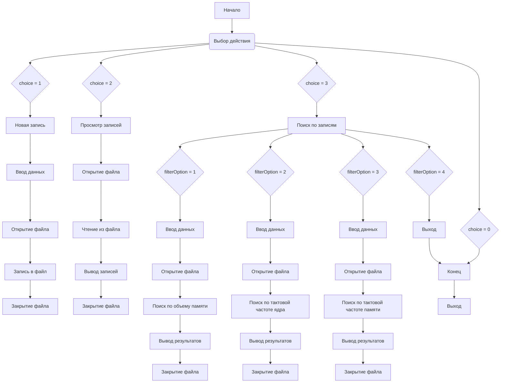

## Module: lab.cpp
- **Module Name**: lab.cpp
- **Primary Objectives**: The module manages a database of video cards allowing users to add new records, view existing records, and search based on specific criteria.
- **Critical Functions**:
  - `main()`: Controls the main flow of the program, including menu options for adding, viewing, and searching video card records.
  - `case 1`: Adds a new video card record to the database file.
  - `case 2`: Displays all video card records in a formatted table.
  - `case 3`: Allows users to search for video cards based on memory size, core clock, or memory clock.
- **Key Variables**:
  - `VideoCard`: Structure containing information about a video card (name, manufacturer, memory size, core clock, memory clock).
  - `file`: File stream for reading and writing video card records.
  - `doc`: Name of the binary file storing video card records.
- **Interdependencies**: The module interacts with the file system to store and retrieve video card records.
- **Core vs. Auxiliary Operations**:
  - Core Operations: Adding new records, viewing records, searching based on criteria.
  - Auxiliary Operations: Input validation, error handling, displaying search results.
- **Operational Sequence**: The program loops through a menu system where users can choose to add new records, view existing records, or search for specific video cards. Each operation interacts with the file system to read or write data.
- **Performance Aspects**: Reading and writing data to a file may impact performance, especially as the database grows. The search operations iterate through all records, which can be inefficient for large datasets.
- **Reusability**: The module can be reused for managing other types of structured data by modifying the `VideoCard` structure and related functions.
- **Usage**: The module can be used to create, store, view, and search video card records. It provides basic functionality for managing a simple database of video cards.
- **Assumptions**:
  - The user interacts with the program through the console interface.
  - Input data is correctly formatted and within expected ranges.
  - The binary file for storing records (`video_cards.bin`) is accessible and writable.
## Flow Diagram [via mermaid]

